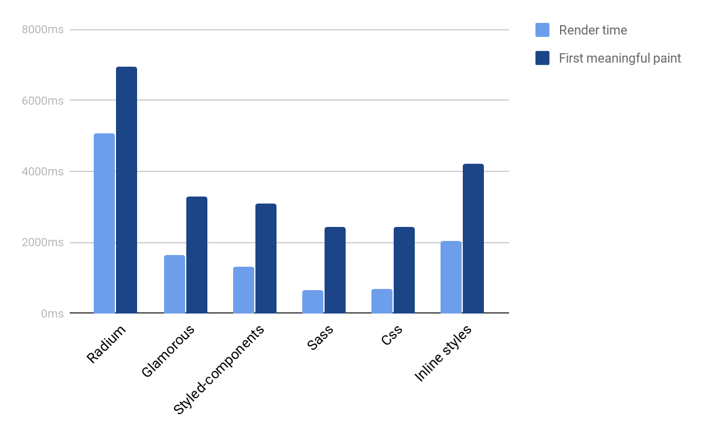

---?image=assets/the-beast.png

<div style="background: rgba(0,0,0,.8); padding: 20px;">
<h3>CSS in Components</h3>
Removing side effects and taming the beast
</div>

---

### Why we are here
Making a case for CSS in JS

Note:

- This is high level and meant to persuade 
---

- What's wrong with CSS
- How we currently deal with it
- How we can do better

---

### Whats wrong with CSS?

---

This will just take a few minutes to fix

---

An hour later, WTF!?
@ul
- Fixed it!
- And... broke ten other things?
@ulend

---

We know what is wrong and how to fix it, but...

---

Refactoring unrelated code = Bad PRs

---

Just a quick fix "for now" 

```js
!important
```

---

### Does this look familiar?
```css
.homepage .footer #linkList a.listitem {
  width: 50% !important;
}
```

---

### It's not your fault

---

It's your teammate's fault

---

> "We live in a society people!"
--George Costanza

---

Can we agree on three things?

---

@ol
- He who writes a global variable shall be shot!
- Side effects suck!
- *Constraint* over *Discipline*
@olend

---

### CSS disagrees

---

@ol
- Global variables are powerful 
- With one selector you can change the whole website
- CSS is forgiving
@olend

---

### The C in CSS
He who has the last word wins

---
### The Cascade
```css
.widget {
    width: 20px;
}
.widget {
    width: 10px;
}
/* I win! */
.widget {
    width: 30px
} 
```
---

...sometimes

---?image=assets/war.jpg
<div style="background: rgba(0,0,0,.6); padding: 20px;">
    <h3> The Great Specificity War!</h3>
</div>

---

#### And such as in war
Everyone loses

---

What is Specificity?

---

> Specificity is the means by which browsers decide which CSS property values are the most relevant to an element and, therefore, will be applied. --MDN

https://developer.mozilla.org/en-US/docs/Web/CSS/Specificity

---

The following list of selector types increases by specificity:
@ol
- Type selectors (e.g., h1) and pseudo-elements (e.g., ::before).
- Class selectors (e.g., .example), attributes selectors (e.g., [type="radio"]) and pseudo-classes (e.g., :hover).
- ID selectors (e.g., #example).
@olend

---

### So... who wins?
 
```css
.homepage .footer #linkList a.listitem {
  background: #EFEFEF !important;
}

div.homepage .footer a.listitem:hover {
  background: #F4F4F4 !important;
}
```

Specificity Calculator: https://specificity.keegan.st/

--- 

### Side Effects
The only thing we have is self discipline

```css
* {
    display: none;
}
```

---

### No way to catch errors

---

CSS is like that mother who loves her child too much...

---

The browser is too forgiving

---

```html
<div class="widgiit">oops</div>
```
<code style="color: red; font-size: 32px; background: white; padding: 10px;">`Uncaught ReferenceError: widgiit is not defined`</code>

---

But people make amazing applications CSS!

---?image=assets/methodology.jpg

<div style="background: rgba(0,0,0,.8); padding: 20px;">
<h3> Methodologies and Tools! </h3>
<p>How we solve problems today</p>
</div>

---

#### Scope through name spacing 
BEM, SUITCSS, ECSS, SMCSS, ACSS

---

### BEM
> — Block Element Modifier is a methodology that helps you to create reusable components and code sharing in front-end development

http://getbem.com/

Note:

- Show that is a component

---

### SUITCSS
> SUIT CSS is a reliable and testable styling methodology for component-based UI development. A collection of CSS packages and build tools are available as modules. SUIT CSS plays well with React, Ember, Angular, and other component-based approaches to UI development.

https://suitcss.github.io/

Note:

- Highlight component
---

All of these methodologies avoid dealing with the cascade and specificity through single selectors.

---

As we saw with BEM and SUITCSS, there is the notion of a component

---

 Rather than styling the page, we look at the reusable pieces that make up the page 
```html
<style>
    .widgitScope { ... }
</style>
<div class="widgetScope"> ... </div>
```
Note:

- CSS is moving towards components
---?image=assets/control-panal.jpg
<div style="background: rgba(0,0,0,.8); padding: 100px 20px;">
 <h3>Components</h3>
</div>
---

### com·po·nent
#### /kəmˈpōnənt/
**noun**
1. a part or element of a larger whole, especially a part of a machine or vehicle.

*synonyms:*	part, piece, bit, element, constituent, ingredient, building block

---

In programming a component is defined as an independent piece of software with a clear boundary accessible through an API

---


Note: 

- Show that we have variant state controlled through an interface
---

```jsx
    <Toggle
        label="Simple"
    />
    <Toggle
        label="Toggled by default"
        defaultToggled={true}
    />
    <Toggle
        label="Disabled"
        disabled={true}
        onChange={ doSomthing }
    />
```
Note:

- shows props interface for state
---

Larger Components can be built out of smaller ones


Note:

- Composible 

---

### Why components?

---

Components offer encapsulation and deterministic behavior

---

They can be pure functions with no side effects

```jsx
const Widget = (props) => (
    <div>
        ...
    </div>
)

```

---

Because they are functions they can be validated, tested and prevent runtime errors

---

Allow for Reuse

---

Accelerate Development

---

User Experience Consistency

Note:

- Design system
- Every toggle looks and behaves the same way
- We are already sold on components so let's get to the point of talking about why they are good
---

### Back to the CSS

---

A component in CSS is just a logical mapping of CSS selectors to an html structure
```html
<style
    .Toggle-wrapper: {
        ...
    }
    .Toggle-switch: {
        ...   
    }
    .Toggle-switch--on {
        ...
    }
    .Toggle-slide: {
        ...
    }

    /* For accessibility */
    .Toggle-checkbox: {
        ...
    }
    .Toggle-label: {
        ...
    }
</style>
<div class="Toggle_wrapper">
    <div class="Toggle_slide">
        <div class="Toggle_switch"></div>
    </div>
    <!-- For accessibility -->
    <form>
        <label class="Toggle_label">Turn me on</label>
        <input type="checkbox" class="Toggle_checkbox"/>
    </form>
</div>
``` 
___


The structure is implied by the CSS

Note:
- Not explicit we have to interpret the intent
- We can break this structure without knowing it
- Shifting context back and forth to understand the structure 

---

A project that uses something like BEM, SUITCSS, ECSS etc. might look like this

```
html/
- shopping-cart-template.html
- callouts-template.html
- products-template.html

js/
- shopping-cart-template.js
- callouts-template.js
- products-template.js

css/
- shopping-cart-template.css
- callouts-template.css
- products-template.css
```
Note:

- We are separating concerns as files but the rules are tightly coupled through discipline
- If we break this expectation we break our app (possibly without knowing it)

---

Some projects take this a step further
```
shopping-cart-template/
- shopping-cart.html
- shopping-cart.css
- shopping-cart.js

callouts-template/
- callouts.html
- callouts.js
- callouts.css

products-template/
- products.html
- products.js
- products.css

```
Note:

- This makes deletion easier
---

### Implicit coupling
This is a superficial relationship that requires parallel maintenance.

Scoping happens through naming conventions and discipline.

---

### Dealing with Variation

---

A component might have variations in a given context like the footer vs the sidebar 

---

We could consider a context modifier

```SCSS
// SCSS syntax
.Widget {
    width: 50%;
    color: rgba(0,0,0,.8);
    .Sidebar & {
        width: 100%;
    }
    .Footer & {
        color: rgba(256,256,256,.8);
    }
}

// Output
.widget { width: 50%; color: rgba(0,0,0,.8);  }
.Sidebar .Widget { width: 100%; }
.Footer .Widget { color: rgba(256,256,256,.8);} 
```

Note:

- To keep easyish code deletion we want to keep this in the component CSS
---

Or a variant modifier
```SCSS
// SCSS syntax
.Widget {
    width: 50%;
    color: rgba(0,0,0,.8);
    &.--fullWidth {
        width: 100%;
    }
    &.--whiteText {
        color: rgba(256,256,256,.8);
    }
}

// Output
.widget { width: 50%; color: rgba(0,0,0,.8);  }
.Widget.--fullWidth { width: 100%; }
.Widget.--whiteText { color: rgba(256,256,256,.8);} 
```
---

Or use utilities

```SCSS

    .u-fullwidth {
        width: 100% !important;
    }

    .u-whiteText {
        color: rgba(256,256,256,.8) !important;
    }

```

---

These are decent solutions given the challenges

---

But we can do better

Note:

- Back to the rules we agreed upon earlier
---
@ul
- Use constraints over discipline
- Eliminate potential for side effects
@ulend
---

@ul
- Have true encapsulation and cohesion
- Test and catch errors
@ulend

Note:

- Like we have with React components
---

@ul
- Easy / Auto code deletion
- Perform complex calculations and generate design systems
@ulend

Note:

- Stack traces
---

As a bonus...
@ul
- Ship self contained modules as packages
- An easy solution to theming
- Use fully featured programing language to manage it all
@ulend

Note:

- Let's stop saying separation of concerns
- Let's do more than imply a relationship with a component
- Let's put our CSS in our Components

---?image=assets/legos.jpg

<div style="background: rgba(0,0,0,.8); padding: 100px 20px;">
    <h3>CSS in Components</h3>
</div>

---

What do you mean "in" components?

---

There are many flavors but 2 approaches.

---

### Inline Styles

```jsx
var divStyle = {
  color: 'white',
  backgroundImage: `url(${imgUrl})`,
  WebkitTransition: 'all', // note the capital 'W' here
  msTransition: 'all' // 'ms' is the only lowercase vendor prefix
};

ReactDOM.render(
    <div style={divStyle}>Hello World!</div>,
mountNode);
```

Note:

- Ask what is missing

---

### Prefixing
```js
import Prefixer from 'inline-style-prefixer'

const style = {
  transition: '200ms all linear',
  userSelect: 'none',
  boxSizing: 'border-box',
  display: 'flex',
  color: 'blue'
}

const prefixer = new Prefixer()
const prefixedStyle = prefixer.prefix(style)

// prefixedStyle === output
const output = {
  transition: '200ms all linear',
  WebkitUserSelect: 'none',
  boxSizing: 'border-box',
  display: '-webkit-flex',
  color: 'blue'
}
```

https://github.com/rofrischmann/inline-style-prefixer

---

### Radium
Gives you things like hover, media queries vender prefixing in a css like syntax

---

```jsx

import Radium from 'radium';
import React from 'react';
import color from 'color';

class Button extends React.Component {
  static propTypes = {
    kind: PropTypes.oneOf(['primary', 'warning']).isRequired
  };
  var styles = {
    base: {
      color: '#fff',
      ':hover': {
        background: color('#0074d9').lighten(0.2).hexString()
      }
    },

    primary: {
      background: '#0074D9'
    },

    warning: {
      background: '#FF4136'
    }
  };

  render() {
    return (
      <button
        style={[
          styles.base,
          styles[this.props.kind]
        ]}>
        {this.props.children}
      </button>
    );
  }
}

Button = Radium(Button);
```

---

### CSS in JS

Note:

- Define a cascading style in our CSS
- CSS modules
---

### Styled Components

---

```js
import styled from 'styled-components';

const Text = styled.div`
  color: white,
  background: black
`

<Text>Hello CSS-in-JS</Text>
```

---

```html
<style>
.hash136s21 {
  background-color: black;
  color: white;
}
</style>

<p class="hash136s21">Hello CSS-in-JS</p>
```
Note:

- uuid
---

### Performance

---



[The Performance of Styled React Components](https://blog.primehammer.com/the-performance-of-styled-react-components/)

Note:

- With browsers improving support it will get better

---

### JSS

[JSS Website](http://cssinjs.org/?v=v9.8.1)

---

### How to handle common use cases

---

### where to go from here?

---

### Thank You!

---

