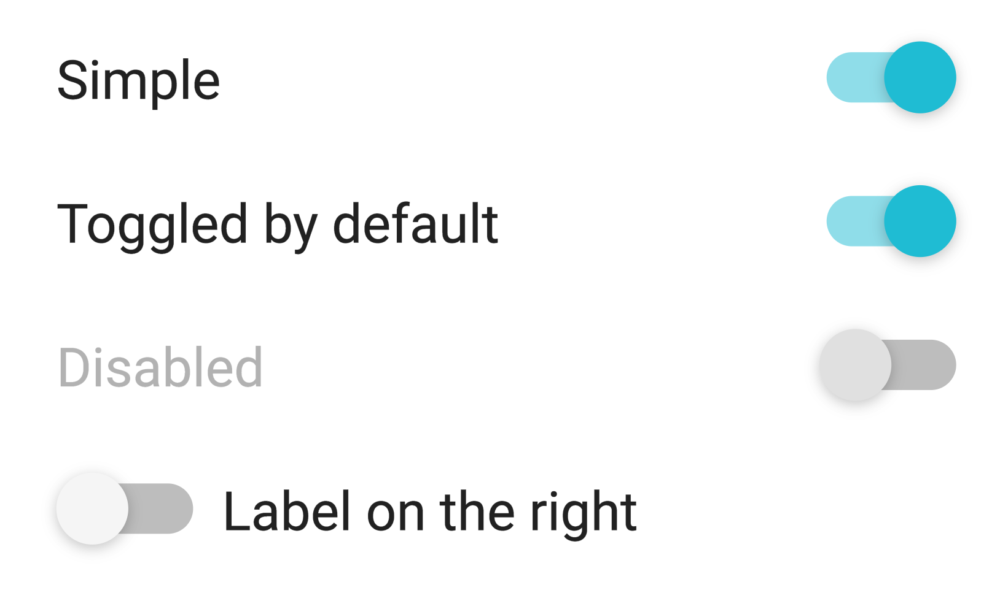
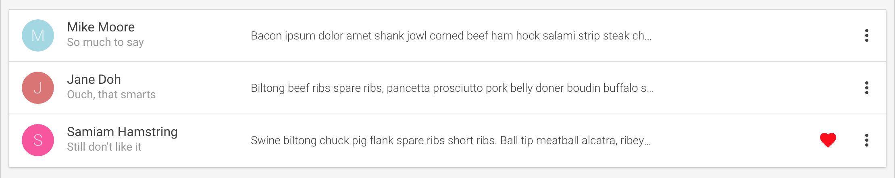

## CSS in Components,
Removing side effects and taming the beast

---

## Whats wrong with CSS?

---

Have you ever set out to solve what seemed to be a small layoout tweek and...

---

- Spent over an hour trying to figure what was causing the issue?
@ul
- Fixed it, only to find out you broke something else?
- Known what was wrong and how to fix it but it required refactoring a buch of code that seemed unrelated (bad PRs)?
- Done something dirty like write an inline style, extra class name or add `!important` to the rule?

@ulend

---

### Does this look familiar?
```css
.homepage .footer #linkList a.listitem {
  width: 50% !important;
}
```

---

### Its not your fault
These are symptoms of some big problems

---

As programers we know to avoid global variables

---

We know that side effects will ruin our day. They make applications brittle and hard to test.

---

We understand that *constraints* are better than *disipline*.

---

### These are literally the core features of CSS

---   

Ok, but why is my style being overwritten?

---

### The cascade
Last word wins...

```css
.widget {
    width: 20px;
}
.widget {
    width: 10px;
}
/* I win! */
.widget {
    width: 30px
} 
```
---

...sometimes
---?image=assets/war.jpg
<div style="background: rgba(0,0,0,.6); padding: 20px;">
    <h3> The Great Specificity War!</h3>
</div>

---

### And Such as in War
Everyone loses

---

> Specificity is the means by which browsers decide which CSS property values are the most relevant to an element and, therefore, will be applied.

https://developer.mozilla.org/en-US/docs/Web/CSS/Specificity
---

The following list of selector types increases by specificity:
@ol
- Type selectors (e.g., h1) and pseudo-elements (e.g., ::before).
- Class selectors (e.g., .example), attributes selectors (e.g., [type="radio"]) and pseudo-classes (e.g., :hover).
- ID selectors (e.g., #example).
@olend

---

### So... who wins?
 
```css
.homepage .footer #linkList a.listitem {
  background: #EFEFEF !important;
}

div.homepage .footer a.listitem::hover {
  background: #F4F4F4 !important;
}
```

Specificity Calculator: https://specificity.keegan.st/

--- 

### Side Effects
A single selector can effect the whole application and the only thing stoping it is disipline

```css
* {
    display: none;
}
```

---

### No way to catch errors
You can write anything. The browser will just skip it

---

```html
<div class="widgiit">oops</div>
```
<code style="color: red; font-size: 32px; background: white; padding: 10px;">`Uncaught ReferenceError: widgiit is not defined`</code>

---

But there are really smart people making amazing applications. How do they avoid these problems?

---

## Methodologies and Tools!

---

### BEM / SUITCSS, ACSS, SMCSS, ECSS

---

All of these methodologies avoid dealing with the cascade and specificity.

---

Many have adopted the notion of a component

---

 Rather than look at the page they look at all of the reusable pieces that make up the page and style them as isolated units with single class names. 
```html
<style>
    .widgitScope { ... }
</style>
<div class="widgetScope"> ... </div>
```
---?image=assets/control-panal.jpg
<div style="background: rgba(0,0,0,.8); padding: 20px;">
 <h3>What is a component?</h3>
</div>
---

### com·po·nent
#### /kəmˈpōnənt/
**noun**
1. a part or element of a larger whole, especially a part of a machine or vehicle.

*synonyms:*	part, piece, bit, element, constituent, ingredient, building block

---

In terms of React, Angular, Vue, Webcomponents, etc.
 
---

We could think of a component as independent piece of software with a clear boundary that is accessible through an API

---



---

```jsx
<Toggle
    label="Simple"
/>
<Toggle
    label="Toggled by default"
    defaultToggled={true}
/>
<Toggle
    label="Disabled"
    disabled={true}
    onChange={ doSomthing }
/>
```
---

Larger Components can be built out of smaller ones


---

### Why components?

---
Allows for Reuse

---

Accelerates Development

---

User Experience Consistency

---

Optimizes the Requirements & Design Process

---

#### It is more than that

---

Components offer incapsulation and deterministic behaviour.

---

They can be imutible, pure functions with no side effects

```jss

const Widget = (props) => (
    <div>
        ...
    </div>
)

```

---

### Back to the CSS

---
A CSS component like in BEM is more of a logical maping of CSS selectors to an html structure
```html
<style>
    .Toggle_wrapper: {
        ...
    }
    .Toggle_switch: {
        ...   
    }
    .Toggle_slide: {
        ...
    }

    /* For accessability */
    .Toggle_checkbox: {
        ...
    }
    .Toggle_label: {
        ...
    }
</style>
<div class="Toggle_wrapper">
    <div class="Toggle_slide">
        <div class="Toggle_switch"></div>
    </div>
    <!-- For accesability -->
    <form>
        <label class="Toggle_label">Turn me on</label>
        <input type="checkbox" class="Toggle_checkbox"/>
    </form>
</div>
``` 
---

The structure is implied by the CSS

---
This is how a project that uses something like BEM, ACSS, ECSS etc. is usually organized

```
html/
- shopping-cart-template.html
- callouts-template.html
- products-template.html

js/
- shopping-cart-template.js
- callouts-template.js
- products-template.js

css/
- shopping-cart-template.css
- callouts-template.css
- products-template.css
```

---

More and more projects are taking this one step further
```
shopping-cart-template/
- shopping-cart.html
- shopping-cart.css
- shopping-cart.js

callouts-template/
- callouts.html
- callouts.js
- callouts.css

products-template/
- products.html
- products.js
- products.css

```

---

### Implicit coupling
This is just a superficial relationship that requires parallel maintanance. Scoping happens through naming conventions and disipline.

---

It is common for a component to be a little different in a given context like the footer vs the sidebar 

---

BEM and the like allow for one more selector defined in the component being changed.

```SCSS
// SCSS syntax
.Widget {
    width: 50%;
    color: rgba(0,0,0,.8);
    .Sidebar & {
        width: 100%;
    }
    .Footer & {
        color: rgba(256,256,256,.8);
    }
}

// Output
.widget { width: 50%; color: rgba(0,0,0,.8);  }
.Sidebar .Widget { width: 100%; }
.Footer .Widget { color: rgba(256,256,256,.8);} 
```
---

This is a good solution given the challenges but we can do better

---
    @ul
    - Use constraints over disipline
    - Eleminate potential for side effects
    @ulend

---
    @ul
    - Have true incapsulation and cohesion
    - We can test and catch errors
    @ulend
---

    As a bonus we can use a fully featured programing language to manage it

---?image=assets/legos.jpg

### CSS in Components

---

### How does it solve?

---

### Options

---

### CSS in JS

---

Do we go into JSS or wrap it up here?

---

### JSS

---

### JSS Examples 

---

### How to handle common use cases

---

### where to go from here?

---

### Thank You!

---

